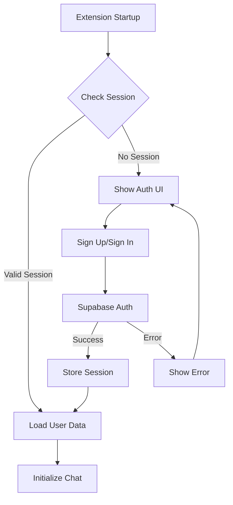

# Design Document

## Overview

The user authentication system will transform the n9n AI Copilot extension from anonymous-only usage to a full user authentication system using Supabase Auth. This design leverages the existing Supabase integration in ChatManager.js and extends it to support proper user authentication, session management, and personalized experiences.

The authentication system will be implemented as a Chrome extension-compatible solution that handles sign-up, sign-in, session persistence, and secure token management while maintaining the existing chat functionality and conversation history.

## Architecture

### Authentication Flow Architecture



### Component Architecture

The authentication system will consist of three main components:

1. **AuthManager** - Core authentication logic and Supabase Auth integration
2. **AuthUI** - User interface components for authentication forms
3. **SessionManager** - Session persistence and validation

### Integration Points

- **ChatManager Integration**: Modify existing ChatManager to use authenticated user IDs instead of anonymous users
- **UIManager Integration**: Add authentication UI components to the existing sidebar
- **Chrome Storage**: Use Chrome's storage API for secure session persistence
- **Supabase Auth**: Leverage Supabase's built-in authentication service

## Components and Interfaces

### AuthManager Class

```javascript
class AuthManager {
  constructor()
  async signUp(email, password)
  async signIn(email, password)
  async signOut()
  async resetPassword(email)
  async getSession()
  async refreshSession()
  isAuthenticated()
  getCurrentUser()
  onAuthStateChange(callback)
}
```

**Key Responsibilities:**
- Handle all Supabase Auth API calls
- Manage authentication state
- Provide authentication status to other components
- Handle session refresh and validation

### AuthUI Component

```javascript
class AuthUI {
  constructor(authManager, uiManager)
  renderSignInForm()
  renderSignUpForm()
  renderPasswordResetForm()
  renderUserProfile()
  showAuthError(message)
  showAuthLoading(isLoading)
  toggleAuthMode(mode)
}
```

**Key Responsibilities:**
- Render authentication forms within the existing sidebar
- Handle form validation and user input
- Display authentication status and errors
- Provide smooth transitions between auth states

### SessionManager Class

```javascript
class SessionManager {
  constructor()
  async storeSession(session)
  async getStoredSession()
  async clearSession()
  async validateSession(session)
  isSessionValid(session)
}
```

**Key Responsibilities:**
- Securely store authentication sessions using Chrome storage
- Validate session expiration
- Handle session cleanup on sign-out

### Modified ChatManager Integration

The existing ChatManager will be updated to:
- Remove anonymous user creation logic
- Use authenticated user ID from AuthManager
- Require authentication before allowing chat functionality
- Associate all conversations and messages with authenticated users

## Data Models

### User Profile (Supabase Auth)
```javascript
{
  id: "uuid",
  email: "user@example.com",
  email_confirmed_at: "timestamp",
  created_at: "timestamp",
  updated_at: "timestamp",
  user_metadata: {
    display_name: "string"
  }
}
```

### Session Data (Chrome Storage)
```javascript
{
  access_token: "jwt_token",
  refresh_token: "refresh_token",
  expires_at: "timestamp",
  user: {
    id: "uuid",
    email: "user@example.com"
  }
}
```

### Authentication State
```javascript
{
  isAuthenticated: boolean,
  user: User | null,
  session: Session | null,
  loading: boolean,
  error: string | null
}
```

## Error Handling

### Authentication Errors
- **Invalid Credentials**: Display user-friendly error message
- **Network Errors**: Show retry option with offline indicator
- **Session Expired**: Automatically redirect to sign-in
- **Email Not Confirmed**: Provide resend confirmation option

### Fallback Strategies
- **Offline Mode**: Cache authentication state for temporary offline usage
- **Storage Errors**: Graceful degradation to session-only authentication
- **API Failures**: Clear error messaging with retry mechanisms

### Error Recovery
- Automatic session refresh on token expiration
- Retry logic for network failures
- Clear error states on successful operations

## Testing Strategy

### Unit Testing
- **AuthManager**: Test all authentication methods with mocked Supabase responses
- **SessionManager**: Test session storage, retrieval, and validation
- **AuthUI**: Test form rendering and user interaction handling

### Integration Testing
- **Auth Flow**: Test complete sign-up and sign-in flows
- **Session Persistence**: Test session storage across browser restarts
- **ChatManager Integration**: Test authenticated chat functionality

### Chrome Extension Testing
- **Manifest Permissions**: Verify required permissions are declared
- **Cross-Context Communication**: Test message passing between content script and background
- **Storage API**: Test Chrome storage functionality

### User Acceptance Testing
- **Sign-up Flow**: New user registration and email confirmation
- **Sign-in Flow**: Returning user authentication
- **Session Management**: Persistent sessions across browser sessions
- **Error Scenarios**: Password reset, invalid credentials, network failures

## Security Considerations

### Token Security
- Store tokens in Chrome's secure storage API
- Implement automatic token refresh
- Clear tokens on sign-out and session expiration

### Data Protection
- Use HTTPS for all authentication requests
- Validate all user inputs on client and server
- Implement proper CORS policies

### Session Management
- Implement secure session validation
- Handle concurrent sessions appropriately
- Provide secure sign-out functionality

### Chrome Extension Security
- Follow Chrome extension security best practices
- Minimize permissions requested
- Validate all cross-context communications

## Implementation Phases

### Phase 1: Core Authentication
- Implement AuthManager with basic sign-up/sign-in
- Create SessionManager for token storage
- Add basic authentication UI components

### Phase 2: UI Integration
- Integrate authentication UI into existing sidebar
- Update UIManager to handle authentication states
- Implement user profile display

### Phase 3: ChatManager Integration
- Modify ChatManager to use authenticated users
- Update conversation and message storage
- Implement user-specific data loading

### Phase 4: Advanced Features
- Add password reset functionality
- Implement session refresh logic
- Add comprehensive error handling

### Phase 5: Testing and Polish
- Comprehensive testing across all flows
- Performance optimization
- User experience refinements